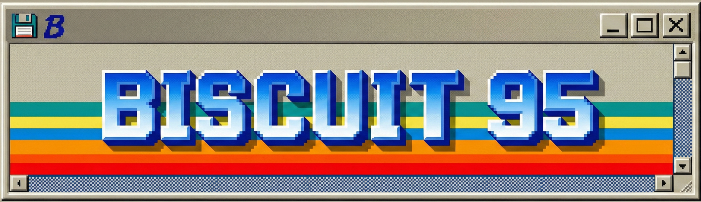
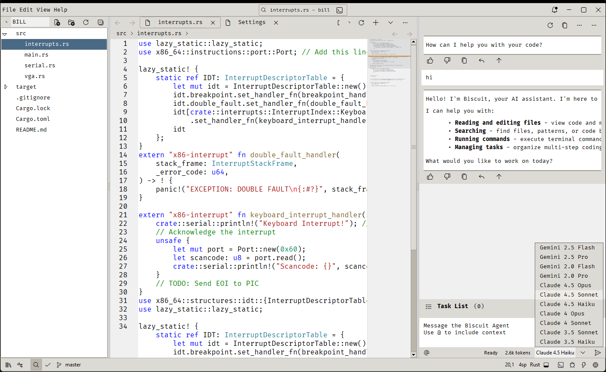
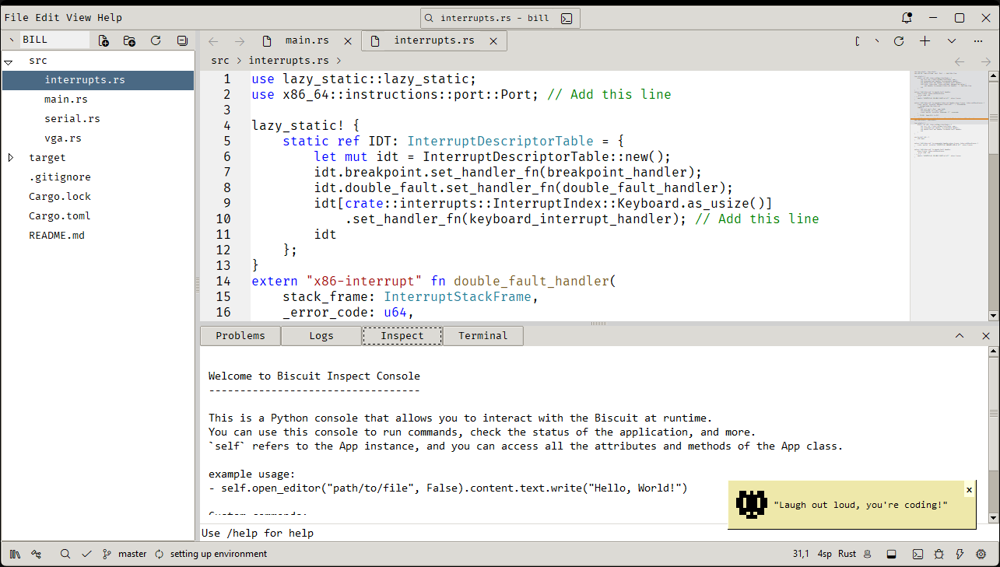

This is a fork of [Biscuit](https://github.com/tomlin7/biscuit) with a Retro Windows 95/98 theme. 

# What's Changed?

- I have gone through the whole codebase and removed the custom theming engine entirely.
- Editor now uses native TTK widgets and styles. It looks similar to good old Windows 95/98.
- **Clippy** - This is an attempt to revive the Microsoft Office 97 Clippy assistant. **But with a more robust context engine and Large Language Models.** So that it can actually be helpful. Clippy is still in beta and can be enabled from the settings.
  
- Clippy uses a local LLM with llama.cpp (setup is fully automated, just enable it from settings).
- Clippy context engine captures User behavior, Git status, AST, Terminal outputs and more (All of these can be selectively enabled/disabled).
- The coding agent is still fully up-to-date with latest AI models and features (kept up-to-date with original repo).

## Known Issues (To be fixed)

Many of the features that broke during the porting process are slowly being fixed.

- Source control is disabled for now.
- Command palette (including other instances of it) is broken right now.
- Extensions center UI is being reworked.
